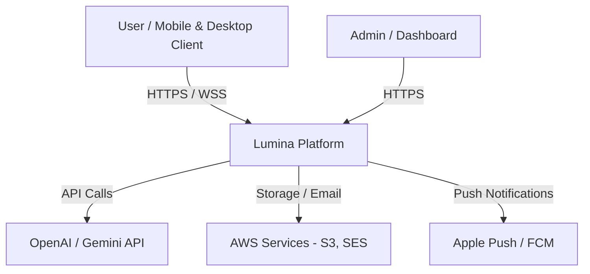
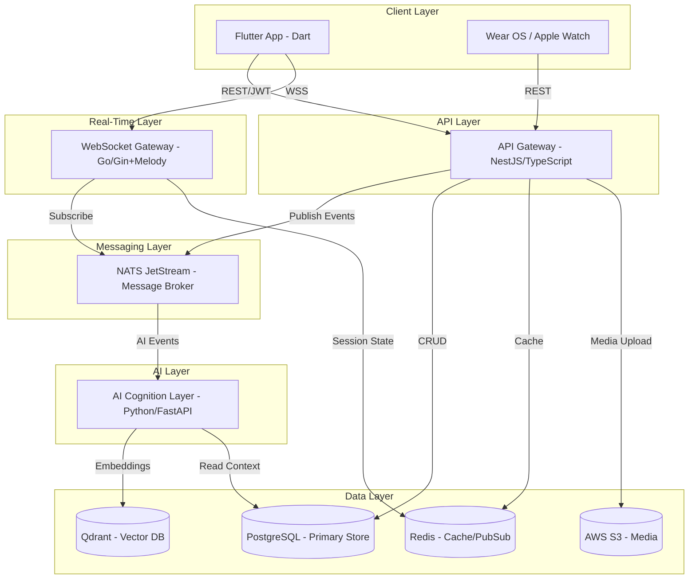
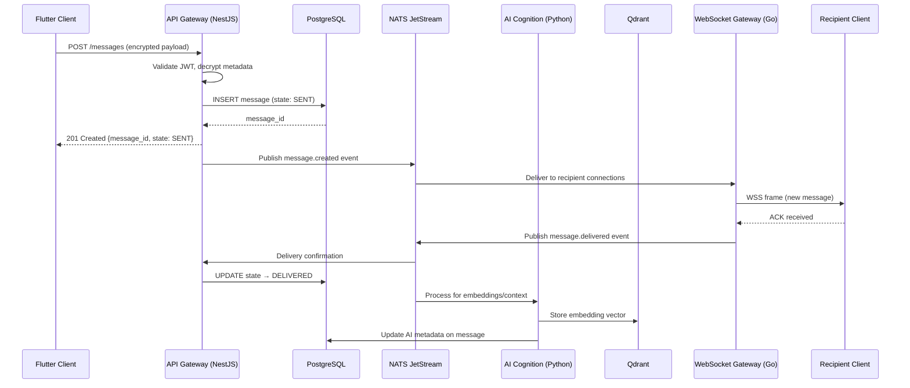
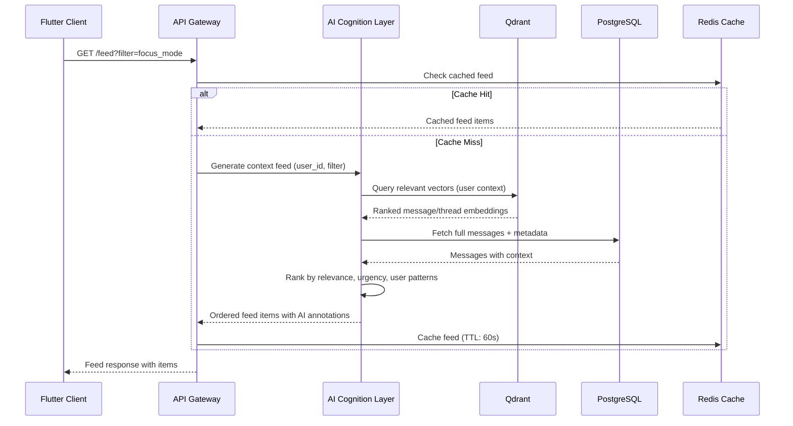
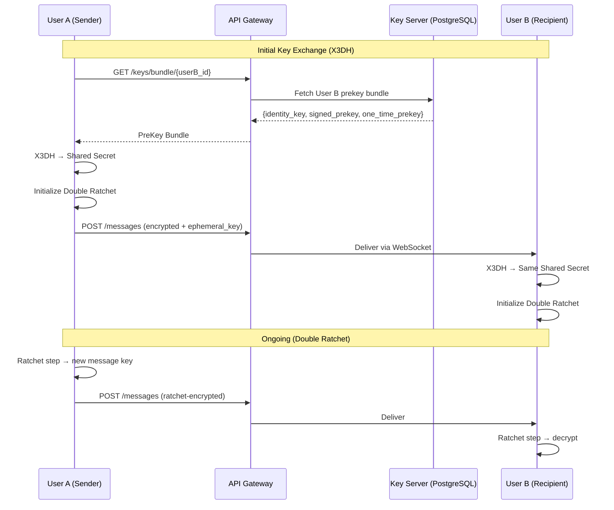

# Design Document: Lumina – AI-Native Context Communication Platform

## Overview

Lumina is a context-first, AI-orchestrated communication platform that replaces traditional rigid messaging silos (DMs, Groups, Channels) with a unified "Context Graph" where conversations, files, and AI insights converge based on relevance. The platform employs an event-driven microservices architecture with a polyglot backend: NestJS (TypeScript) for the API Gateway with CQRS, Go for the high-performance WebSocket real-time engine, and Python (FastAPI) for the AI Cognition Layer. The frontend is built with Flutter using Riverpod state management and an Apple-inspired glassmorphism design system.

The system prioritizes security (Signal Protocol E2EE), offline-first capabilities (Drift/SQLite with NATS JetStream sync), and AI-native features including semantic search via Qdrant vector DB, catch-up summaries, real-time translation, and a dynamic context graph that intelligently surfaces relevant content. Infrastructure is managed via GitOps (Terraform + ArgoCD) on AWS EKS.

## Architecture

### System Context (C4 Level 1)



### Container Diagram (C4 Level 2)



## Sequence Diagrams

### Message Send Flow



### Context Graph Feed Generation



### E2EE Key Exchange Flow



## Components and Interfaces

### Component 1: API Gateway (NestJS / TypeScript)

**Purpose**: Central REST API handling authentication, authorization, CQRS command/query dispatch, rate limiting, and request validation.

**Interface**:

```typescript
// Auth Module
interface AuthService {
  register(dto: RegisterDto): Promise<AuthTokenPair>;
  login(dto: LoginDto): Promise<AuthTokenPair>;
  refreshToken(refreshToken: string): Promise<AuthTokenPair>;
  registerPasskey(userId: string, credential: PasskeyCredential): Promise<void>;
  verifyPasskey(challenge: PasskeyChallenge): Promise<AuthTokenPair>;
}

// Message Module (CQRS)
interface MessageCommandHandler {
  sendMessage(command: SendMessageCommand): Promise<MessageResponse>;
  editMessage(command: EditMessageCommand): Promise<MessageResponse>;
  deleteMessage(command: DeleteMessageCommand): Promise<void>;
  reactToMessage(command: ReactCommand): Promise<ReactionResponse>;
}

interface MessageQueryHandler {
  getMessages(query: GetMessagesQuery): Promise<PaginatedMessages>;
  searchMessages(query: SearchQuery): Promise<SearchResults>;
  getThread(query: GetThreadQuery): Promise<ThreadMessages>;
}

// Chat Module
interface ChatService {
  createChat(dto: CreateChatDto): Promise<Chat>;
  addMembers(chatId: string, members: AddMembersDto): Promise<void>;
  removeMember(chatId: string, memberId: string): Promise<void>;
  updateChat(chatId: string, dto: UpdateChatDto): Promise<Chat>;
}

// Feed Module
interface FeedService {
  getContextFeed(userId: string, filter: FeedFilter): Promise<FeedItem[]>;
  getActionRequired(userId: string): Promise<FeedItem[]>;
  getCatchUpSummary(userId: string): Promise<CatchUpSummary>;
}
```

**Responsibilities**:
- JWT/OAuth2/Passkey authentication and token management
- Request validation and rate limiting (sliding window)
- CQRS command/query separation for message handling
- Event publishing to NATS JetStream
- Media upload orchestration to S3
- Feed endpoint aggregation

### Component 2: Real-Time WebSocket Gateway (Go)

**Purpose**: High-performance WebSocket server managing millions of persistent connections, subscribing to NATS for real-time event delivery.

**Interface**:

```go
// Connection Manager
type ConnectionManager interface {
    RegisterConnection(ctx context.Context, conn *WSConnection) error
    UnregisterConnection(connID string) error
    GetUserConnections(userID string) []*WSConnection
    BroadcastToChat(chatID string, event Event) error
    SendToUser(userID string, event Event) error
    GetOnlineUsers(chatID string) []string
}

// Event Handler
type EventHandler interface {
    HandleMessageCreated(event MessageCreatedEvent) error
    HandleMessageDelivered(event MessageDeliveredEvent) error
    HandleTypingIndicator(event TypingEvent) error
    HandlePresenceUpdate(event PresenceEvent) error
    HandleReadReceipt(event ReadReceiptEvent) error
}

// NATS Subscriber
type NATSSubscriber interface {
    Subscribe(subject string, handler EventHandler) error
    Unsubscribe(subject string) error
    PublishAck(subject string, ack AckEvent) error
}

// WebSocket Connection
type WSConnection struct {
    ID        string
    UserID    string
    DeviceID  string
    ChatSubs  []string
    Conn      *melody.Session
    CreatedAt time.Time
}
```

**Responsibilities**:
- Managing WebSocket connection lifecycle (connect, heartbeat, disconnect)
- Subscribing to NATS subjects per user/chat membership
- Broadcasting real-time events (messages, typing, presence, read receipts)
- Connection-level rate limiting and backpressure
- Device-aware delivery (multi-device support)
- Presence tracking with "Aura" state management

### Component 3: AI Cognition Layer (Python / FastAPI)

**Purpose**: AI-powered processing pipeline for semantic search, context graph generation, catch-up summaries, real-time translation, and message embedding.

**Interface**:

```python
# Embedding Service
class EmbeddingService(Protocol):
    async def embed_message(self, message: Message) -> EmbeddingResult: ...
    async def embed_batch(self, messages: list[Message]) -> list[EmbeddingResult]: ...
    async def semantic_search(self, query: str, user_id: str, top_k: int = 10) -> list[SearchHit]: ...

# Context Graph Service
class ContextGraphService(Protocol):
    async def generate_feed(self, user_id: str, filter: FeedFilter) -> list[FeedItem]: ...
    async def compute_relevance(self, user_id: str, message: Message) -> float: ...
    async def find_cross_context_threads(self, user_id: str) -> list[UnifiedThread]: ...

# Summary Service
class SummaryService(Protocol):
    async def generate_catch_up(self, user_id: str, since: datetime) -> CatchUpSummary: ...
    async def summarize_thread(self, thread_id: str) -> ThreadSummary: ...
    async def extract_action_items(self, chat_id: str, since: datetime) -> list[ActionItem]: ...

# Translation Service
class TranslationService(Protocol):
    async def translate_message(self, message: Message, target_lang: str) -> TranslatedMessage: ...
    async def detect_language(self, text: str) -> LanguageDetection: ...
    async def suggest_grammar(self, text: str, lang: str) -> list[GrammarSuggestion]: ...

# RAG Pipeline
class RAGPipeline(Protocol):
    async def query(self, question: str, context: RAGContext) -> RAGResponse: ...
    async def index_document(self, doc: Document) -> None: ...
    async def reindex_chat(self, chat_id: str) -> IndexingResult: ...
```

**Responsibilities**:
- Message embedding generation (text-embedding-3-small via OpenAI)
- Vector storage and retrieval via Qdrant
- Context graph relevance scoring and feed generation
- Catch-up summary generation (3-bullet format)
- Action item extraction from conversations
- Real-time translation with language detection
- RAG pipeline for contextual AI responses
- Cross-context thread discovery

### Component 4: Flutter Client (Dart)

**Purpose**: Cross-platform mobile/desktop client with offline-first architecture, E2EE, glassmorphism UI, and Riverpod state management.

**Interface**:

```dart
// Message Repository (Offline-First)
abstract class MessageRepository {
  Future<Message> sendMessage(SendMessageRequest request);
  Stream<List<Message>> watchMessages(String chatId);
  Future<PaginatedResult<Message>> getMessages(String chatId, {int page, int limit});
  Future<void> syncPendingMessages();
  Future<void> markAsRead(String chatId, String messageId);
}

// E2EE Service
abstract class E2EEService {
  Future<EncryptedPayload> encrypt(String plaintext, String recipientId);
  Future<String> decrypt(EncryptedPayload payload, String senderId);
  Future<void> initializeSession(String userId, PreKeyBundle bundle);
  Future<void> performRatchetStep(String sessionId);
  Future<KeyPair> generateIdentityKeyPair();
  Future<PreKeyBundle> generatePreKeyBundle();
}

// Context Feed Provider (Riverpod)
abstract class ContextFeedNotifier extends AsyncNotifier<FeedState> {
  Future<void> loadFeed(FeedFilter filter);
  Future<void> refreshFeed();
  Future<void> markItemActioned(String itemId);
}

// Aura (Presence) Manager
abstract class AuraManager {
  Stream<AuraState> watchUserAura(String userId);
  Future<void> updateMyAura(AuraState state);
  AuraState get currentAura;
}
```

**Responsibilities**:
- Offline-first data layer with Drift (SQLite) local storage
- Optimistic UI updates (SENT_LOCAL → SENT → DELIVERED → READ)
- Signal Protocol E2EE (Double Ratchet + X3DH)
- Riverpod-based reactive state management
- Glassmorphism UI with 120fps animations
- Background sync via isolates
- Push notification handling (FCM/APNs)
- Multi-device key synchronization

### Component 5: NATS JetStream (Message Broker)

**Purpose**: Event backbone providing exactly-once delivery, event sourcing, offline message queuing, and decoupled communication between all services.

**Subjects and Streams**:

```typescript
// NATS Subject Hierarchy
const SUBJECTS = {
  // Message lifecycle events
  MESSAGE_CREATED: 'lumina.message.created.{chatId}',
  MESSAGE_DELIVERED: 'lumina.message.delivered.{chatId}',
  MESSAGE_READ: 'lumina.message.read.{chatId}',
  MESSAGE_EDITED: 'lumina.message.edited.{chatId}',
  MESSAGE_DELETED: 'lumina.message.deleted.{chatId}',
  
  // AI processing pipeline
  AI_EMBED: 'lumina.ai.embed',
  AI_SUMMARIZE: 'lumina.ai.summarize.{chatId}',
  AI_TRANSLATE: 'lumina.ai.translate',
  AI_CONTEXT_UPDATE: 'lumina.ai.context.{userId}',
  
  // Presence & typing
  PRESENCE_UPDATE: 'lumina.presence.{userId}',
  TYPING_INDICATOR: 'lumina.typing.{chatId}.{userId}',
  
  // User events
  USER_OFFLINE_QUEUE: 'lumina.offline.{userId}',
  PUSH_NOTIFICATION: 'lumina.push.{userId}',
};

// Stream Configuration
interface StreamConfig {
  name: string;
  subjects: string[];
  retention: 'limits' | 'interest' | 'workqueue';
  maxAge: Duration;
  storage: 'file' | 'memory';
  replicas: number;
  deduplicationWindow: Duration;
}
```

**Responsibilities**:
- Exactly-once message delivery semantics
- Event sourcing for message lifecycle
- Offline message queuing per user (durable consumers)
- Work queue distribution for AI processing tasks
- Presence event fanout
- Cross-service event choreography

## Data Models

### User Model

```typescript
interface User {
  id: string;              // UUID v7 (time-sortable)
  email: string;           // unique, validated
  username: string;        // unique, 3-30 chars, alphanumeric + underscore
  displayName: string;     // 1-50 chars
  avatarUrl?: string;      // S3 presigned URL
  publicKey: string;       // X25519 identity public key (Base64)
  signedPreKey: string;    // Signed pre-key for X3DH
  oneTimePreKeys: string[];// One-time pre-keys pool
  auraState: AuraState;    // Current availability
  lastSeen: DateTime;
  devices: Device[];
  createdAt: DateTime;
  updatedAt: DateTime;
}

enum AuraState {
  AVAILABLE = 'available',
  DEEP_WORK = 'deep_work',
  AWAY = 'away',
  DO_NOT_DISTURB = 'do_not_disturb',
  OFFLINE = 'offline',
}

interface Device {
  id: string;
  userId: string;
  platform: 'ios' | 'android' | 'web' | 'desktop' | 'wearos';
  pushToken?: string;
  publicKey: string;       // Per-device key for multi-device E2EE
  lastActive: DateTime;
}
```

**Validation Rules**:
- Email must be RFC 5322 compliant
- Username: `/^[a-zA-Z0-9_]{3,30}$/`
- Public keys must be valid Base64-encoded X25519 keys
- One-time pre-key pool minimum: 20 keys (replenish trigger at 5)

### Chat Model

```typescript
interface Chat {
  id: string;              // UUID v7
  type: ChatType;
  name?: string;           // Required for GROUP/CHANNEL/BROADCAST
  description?: string;
  avatarUrl?: string;
  createdBy: string;       // User ID
  members: ChatMember[];
  settings: ChatSettings;
  lastMessageAt?: DateTime;
  createdAt: DateTime;
  updatedAt: DateTime;
}

enum ChatType {
  DIRECT = 'direct',
  GROUP = 'group',
  CHANNEL = 'channel',
  BROADCAST = 'broadcast',
}

interface ChatMember {
  id: string;
  chatId: string;
  userId: string;
  role: MemberRole;
  joinedAt: DateTime;
  lastReadMessageId?: string;
  mutedUntil?: DateTime;
  senderKey?: string;       // Group E2EE sender key
}

enum MemberRole {
  OWNER = 'owner',
  ADMIN = 'admin',
  MEMBER = 'member',
  READONLY = 'readonly',
}

interface ChatSettings {
  e2eeEnabled: boolean;
  disappearingMessages?: Duration;
  antiScreenshot: boolean;
  allowReactions: boolean;
  allowThreads: boolean;
  slowMode?: Duration;     // Minimum time between user messages
}
```

**Validation Rules**:
- DIRECT chats must have exactly 2 members
- GROUP chats: 3-1024 members
- CHANNEL/BROADCAST: unlimited members
- Only OWNER can enable/disable E2EE
- Disappearing message duration: minimum 5 seconds, maximum 1 year

### Message Model

```typescript
interface Message {
  id: string;              // UUID v7 (time-sortable)
  chatId: string;
  senderId: string;
  replyToId?: string;      // Thread parent message
  content: EncryptedContent;
  contentType: ContentType;
  state: MessageState;
  aiMetadata?: AIMetadata;
  embeddingId?: string;    // Qdrant vector ID
  reactions: Reaction[];
  editedAt?: DateTime;
  expiresAt?: DateTime;    // Disappearing messages
  createdAt: DateTime;
  updatedAt: DateTime;
}

interface EncryptedContent {
  ciphertext: string;      // Base64-encoded encrypted payload
  nonce: string;           // Base64-encoded nonce
  ephemeralKey?: string;   // For initial X3DH message
  messageNumber: number;   // Double Ratchet message number
  chainIndex: number;      // Ratchet chain index
}

enum ContentType {
  TEXT = 'text',
  IMAGE = 'image',
  VIDEO = 'video',
  AUDIO = 'audio',
  FILE = 'file',
  VOICE_NOTE = 'voice_note',
  LOCATION = 'location',
  CONTACT = 'contact',
  SYSTEM = 'system',
}

enum MessageState {
  SENT_LOCAL = 'sent_local',   // Optimistic UI (client only)
  SENT = 'sent',               // Persisted to server
  DELIVERED = 'delivered',     // Received by recipient device
  READ = 'read',              // Opened by recipient
  FAILED = 'failed',          // Send failed
}

interface AIMetadata {
  summary?: string;
  language?: string;
  sentiment?: number;       // -1.0 to 1.0
  actionItems?: string[];
  topics?: string[];
  translatedContent?: Record<string, string>; // lang_code → translation
}

interface Reaction {
  id: string;
  messageId: string;
  userId: string;
  emoji: string;            // Unicode emoji or custom emoji ID
  createdAt: DateTime;
}
```

**Validation Rules**:
- Ciphertext max size: 64KB (text), 100MB (media reference)
- Emoji reactions: max 20 unique emojis per message
- Thread depth: maximum 1 level (reply to reply flattens to parent)
- Message edit window: 24 hours from creation

### Context Feed Model

```typescript
interface FeedItem {
  id: string;
  userId: string;          // Feed owner
  type: FeedItemType;
  relevanceScore: number;  // 0.0 - 1.0 (AI-computed)
  sourceChat: ChatSummary;
  preview: FeedPreview;
  actionRequired: boolean;
  aiAnnotation?: string;   // AI context note
  createdAt: DateTime;
  expiresAt: DateTime;     // Feed item TTL
}

enum FeedItemType {
  NEW_MESSAGES = 'new_messages',
  MENTION = 'mention',
  ACTION_ITEM = 'action_item',
  THREAD_UPDATE = 'thread_update',
  CROSS_CONTEXT = 'cross_context',
  CATCH_UP_SUMMARY = 'catch_up_summary',
}

enum FeedFilter {
  ALL = 'all',
  FOCUS_MODE = 'focus_mode',         // High priority only
  ACTION_REQUIRED = 'action_required', // Items needing response
  CATCH_UP = 'catch_up',             // AI-summarized missed content
}

interface CatchUpSummary {
  userId: string;
  period: { from: DateTime; to: DateTime };
  bulletPoints: [string, string, string]; // Exactly 3 bullets
  topChats: ChatSummary[];
  actionItems: ActionItem[];
  unreadCount: number;
}
```

## Algorithmic Pseudocode

### Algorithm 1: Context Graph Relevance Scoring

```pascal
ALGORITHM computeRelevanceScore(userId, message, userContext)
INPUT: userId: UUID, message: Message, userContext: UserContext
OUTPUT: score: Float [0.0, 1.0]

BEGIN
  ASSERT message IS NOT NULL
  ASSERT userContext.recentTopics IS NOT EMPTY

  // Step 1: Compute semantic similarity
  messageEmbedding ← getEmbedding(message.content)
  userTopicEmbeddings ← getRecentTopicEmbeddings(userId, limit: 50)
  
  semanticScore ← 0.0
  FOR EACH topicEmbed IN userTopicEmbeddings DO
    INVARIANT: semanticScore >= 0.0
    similarity ← cosineSimilarity(messageEmbedding, topicEmbed)
    semanticScore ← MAX(semanticScore, similarity)
  END FOR

  // Step 2: Compute social proximity score
  socialScore ← computeSocialProximity(userId, message.senderId)
  // socialScore factors: message frequency, response rate, mutual chats

  // Step 3: Compute temporal urgency
  timeSinceMessage ← NOW() - message.createdAt
  temporalDecay ← EXP(-0.1 * timeSinceMessage.hours)
  
  // Step 4: Compute interaction signals
  mentionsUser ← containsMention(message, userId)
  isReplyToUser ← message.replyToId IN getUserMessageIds(userId)
  interactionBoost ← 0.0
  IF mentionsUser THEN interactionBoost ← 0.3 END IF
  IF isReplyToUser THEN interactionBoost ← 0.4 END IF

  // Step 5: Weighted combination
  score ← (0.35 * semanticScore) 
         + (0.25 * socialScore) 
         + (0.20 * temporalDecay) 
         + (0.20 * interactionBoost)

  // Clamp to valid range
  score ← CLAMP(score, 0.0, 1.0)

  ASSERT score >= 0.0 AND score <= 1.0
  RETURN score
END
```

**Preconditions:**
- `userId` exists in database and has activity history
- `message` is a valid, non-deleted message
- `userContext.recentTopics` has at least 1 topic embedding

**Postconditions:**
- Returns float in [0.0, 1.0]
- Score reflects multi-signal relevance assessment
- Pure function: no side effects

**Loop Invariants:**
- `semanticScore` is always non-negative
- Each iteration considers one topic embedding

### Algorithm 2: Double Ratchet Message Encryption

```pascal
ALGORITHM encryptMessage(session, plaintext)
INPUT: session: RatchetSession, plaintext: Bytes
OUTPUT: encryptedMessage: EncryptedContent

BEGIN
  ASSERT session.isInitialized = TRUE
  ASSERT LENGTH(plaintext) > 0 AND LENGTH(plaintext) <= 65536

  // Step 1: Derive message key from sending chain
  (chainKey, messageKey) ← KDF_CK(session.sendingChainKey)
  session.sendingChainKey ← chainKey
  session.sendingMessageNumber ← session.sendingMessageNumber + 1

  // Step 2: Encrypt plaintext with message key
  nonce ← generateNonce(12)  // 96-bit random nonce
  ciphertext ← AES_GCM_ENCRYPT(messageKey, nonce, plaintext)

  // Step 3: Construct encrypted content
  encryptedMessage ← EncryptedContent {
    ciphertext: BASE64_ENCODE(ciphertext),
    nonce: BASE64_ENCODE(nonce),
    messageNumber: session.sendingMessageNumber,
    chainIndex: session.sendingChainIndex,
    ephemeralKey: IF session.needsRatchetHeader 
                 THEN BASE64_ENCODE(session.currentRatchetPublicKey)
                 ELSE NULL
  }

  // Step 4: Cleanup sensitive material
  SECURE_ZERO(messageKey)
  SECURE_ZERO(nonce)

  ASSERT encryptedMessage.ciphertext IS NOT EMPTY
  ASSERT encryptedMessage.messageNumber = session.sendingMessageNumber
  RETURN encryptedMessage
END

ALGORITHM decryptMessage(session, encryptedContent, senderIdentity)
INPUT: session: RatchetSession, encryptedContent: EncryptedContent, senderIdentity: PublicKey
OUTPUT: plaintext: Bytes

BEGIN
  ASSERT session.isInitialized = TRUE
  ASSERT encryptedContent.ciphertext IS NOT EMPTY

  // Step 1: Check if DH ratchet step needed
  IF encryptedContent.ephemeralKey IS NOT NULL THEN
    // Perform DH ratchet step
    sharedSecret ← DH(session.currentRatchetPrivateKey, encryptedContent.ephemeralKey)
    (session.receivingChainKey, session.rootKey) ← KDF_RK(session.rootKey, sharedSecret)
    
    // Generate new ratchet key pair
    session.currentRatchetPrivateKey ← GENERATE_DH_KEYPAIR().private
    session.currentRatchetPublicKey ← DERIVE_PUBLIC(session.currentRatchetPrivateKey)
    session.sendingChainIndex ← session.sendingChainIndex + 1
    session.needsRatchetHeader ← TRUE
  END IF

  // Step 2: Skip message keys for out-of-order messages
  WHILE session.receivingMessageNumber < encryptedContent.messageNumber DO
    INVARIANT: session.receivingMessageNumber < encryptedContent.messageNumber
    (session.receivingChainKey, skippedKey) ← KDF_CK(session.receivingChainKey)
    storeSkippedKey(session, session.receivingMessageNumber, skippedKey)
    session.receivingMessageNumber ← session.receivingMessageNumber + 1
  END WHILE

  // Step 3: Derive message key
  (session.receivingChainKey, messageKey) ← KDF_CK(session.receivingChainKey)
  session.receivingMessageNumber ← session.receivingMessageNumber + 1

  // Step 4: Decrypt
  ciphertext ← BASE64_DECODE(encryptedContent.ciphertext)
  nonce ← BASE64_DECODE(encryptedContent.nonce)
  plaintext ← AES_GCM_DECRYPT(messageKey, nonce, ciphertext)

  IF plaintext = DECRYPTION_FAILED THEN
    RAISE DecryptionError("Failed to decrypt message")
  END IF

  // Step 5: Cleanup
  SECURE_ZERO(messageKey)

  ASSERT LENGTH(plaintext) > 0
  RETURN plaintext
END
```

**Preconditions:**
- Session has been initialized via X3DH key agreement
- Plaintext size ≤ 64KB for text messages
- Both parties have valid identity keys

**Postconditions:**
- Encryption produces unique ciphertext per message (nonce uniqueness)
- Decryption recovers exact original plaintext
- Message keys are zeroed after use (forward secrecy)
- Out-of-order messages are handled via skipped key storage

**Loop Invariants:**
- Skipped message counter monotonically approaches target message number
- All skipped keys are stored for potential future decryption

### Algorithm 3: Offline Sync Reconciliation

```pascal
ALGORITHM reconcileOfflineMessages(userId, localState, serverState)
INPUT: userId: UUID, localState: SyncState, serverState: SyncState
OUTPUT: syncResult: SyncResult

BEGIN
  ASSERT localState.lastSyncTimestamp <= NOW()
  
  result ← SyncResult { incoming: [], outgoing: [], conflicts: [] }

  // Step 1: Fetch server messages since last sync
  serverMessages ← NATS_FETCH_PENDING(
    subject: "lumina.offline.{userId}",
    since: localState.lastSyncTimestamp,
    maxBatch: 500
  )

  // Step 2: Identify local pending messages (SENT_LOCAL state)
  localPending ← LOCAL_DB_QUERY(
    "SELECT * FROM messages WHERE state = 'sent_local' AND senderId = ?",
    userId
  )

  // Step 3: Process incoming server messages
  FOR EACH serverMsg IN serverMessages DO
    INVARIANT: ALL previously processed messages are stored locally
    
    existsLocally ← LOCAL_DB_EXISTS(serverMsg.id)
    IF NOT existsLocally THEN
      // New message from server - insert locally
      decrypted ← decryptMessage(getSession(serverMsg.senderId), serverMsg.content)
      LOCAL_DB_INSERT(serverMsg WITH { decryptedContent: decrypted })
      result.incoming.ADD(serverMsg)
    ELSE
      // Possible state update (e.g., DELIVERED → READ)
      localMsg ← LOCAL_DB_GET(serverMsg.id)
      IF serverMsg.state > localMsg.state THEN
        LOCAL_DB_UPDATE_STATE(serverMsg.id, serverMsg.state)
      END IF
    END IF
    
    NATS_ACK(serverMsg)
  END FOR

  // Step 4: Push local pending messages to server
  FOR EACH localMsg IN localPending DO
    INVARIANT: No duplicate sends (idempotency via message ID)
    
    response ← API_POST("/messages", localMsg)
    IF response.status = 201 THEN
      LOCAL_DB_UPDATE_STATE(localMsg.id, SENT)
      result.outgoing.ADD(localMsg)
    ELSE IF response.status = 409 THEN
      // Conflict: message already exists on server
      result.conflicts.ADD(ConflictRecord(localMsg, response.serverVersion))
    ELSE
      // Keep as SENT_LOCAL for next sync attempt
      LOG_WARNING("Failed to sync message", localMsg.id, response)
    END IF
  END FOR

  // Step 5: Update sync checkpoint
  localState.lastSyncTimestamp ← NOW()
  LOCAL_DB_UPDATE_SYNC_STATE(localState)

  ASSERT result.incoming.size + result.conflicts.size = serverMessages.size
  RETURN result
END
```

**Preconditions:**
- User is authenticated and has valid session
- Local database (Drift/SQLite) is accessible
- NATS JetStream consumer exists for user's offline queue

**Postconditions:**
- All server messages are persisted locally
- All local pending messages are attempted for server delivery
- Sync timestamp is advanced to current time
- No messages are lost (at-least-once delivery)
- Conflicts are reported for UI resolution

**Loop Invariants:**
- All previously processed server messages exist in local DB
- No duplicate server submissions (idempotent by message ID)

### Algorithm 4: Catch-Up Summary Generation

```pascal
ALGORITHM generateCatchUpSummary(userId, since)
INPUT: userId: UUID, since: DateTime
OUTPUT: summary: CatchUpSummary

BEGIN
  ASSERT since < NOW()
  ASSERT (NOW() - since) >= Duration(minutes: 30)

  // Step 1: Gather unread messages across all user's chats
  userChats ← DB_QUERY("SELECT chatId FROM chat_members WHERE userId = ?", userId)
  allUnread ← []
  
  FOR EACH chatId IN userChats DO
    INVARIANT: allUnread contains messages only from processed chats
    
    lastRead ← DB_QUERY(
      "SELECT lastReadMessageId FROM chat_members WHERE chatId = ? AND userId = ?",
      chatId, userId
    )
    unreadMessages ← DB_QUERY(
      "SELECT * FROM messages WHERE chatId = ? AND createdAt > ? ORDER BY createdAt",
      chatId, since
    )
    allUnread.ADD_ALL(unreadMessages)
  END FOR

  // Step 2: Rank chats by activity and relevance
  chatScores ← {}
  FOR EACH msg IN allUnread DO
    chatScores[msg.chatId] ← chatScores[msg.chatId] + computeRelevanceScore(userId, msg)
  END FOR
  topChats ← TOP_K(chatScores, k: 5)

  // Step 3: Generate AI summary (3 bullets)
  contextWindow ← formatForLLM(allUnread, topChats, maxTokens: 4000)
  
  llmResponse ← LLM_CALL(
    model: "gpt-4o-mini",
    systemPrompt: CATCH_UP_SYSTEM_PROMPT,
    userPrompt: contextWindow,
    maxOutputTokens: 300,
    temperature: 0.3
  )
  
  bulletPoints ← parseBulletPoints(llmResponse, exactCount: 3)
  ASSERT LENGTH(bulletPoints) = 3

  // Step 4: Extract action items
  actionItems ← extractActionItems(allUnread, userId)

  // Step 5: Assemble summary
  summary ← CatchUpSummary {
    userId: userId,
    period: { from: since, to: NOW() },
    bulletPoints: bulletPoints,
    topChats: topChats.map(toChatSummary),
    actionItems: actionItems,
    unreadCount: LENGTH(allUnread)
  }

  ASSERT LENGTH(summary.bulletPoints) = 3
  ASSERT summary.unreadCount >= 0
  RETURN summary
END
```

**Preconditions:**
- User has been inactive for at least 30 minutes
- User has at least one chat with unread messages
- LLM service is available

**Postconditions:**
- Summary contains exactly 3 bullet points
- Top chats are ordered by relevance score
- Action items are extracted and attributed
- Summary period matches the inactivity window

**Loop Invariants:**
- `allUnread` only contains messages from the user's chats
- `chatScores` keys are a subset of user's chat IDs

## Key Functions with Formal Specifications

### Function: sendMessage (API Gateway - TypeScript)

```typescript
async function sendMessage(command: SendMessageCommand): Promise<MessageResponse> {
  // Implementation in NestJS CQRS command handler
}
```

**Preconditions:**
- `command.senderId` is authenticated and authorized for `command.chatId`
- `command.content.ciphertext` is non-empty and ≤ 64KB
- `command.chatId` exists and sender is an active member
- If E2EE enabled: `command.content.ephemeralKey` and `command.content.nonce` are present
- Rate limit not exceeded for sender (100 messages/minute)

**Postconditions:**
- Message persisted to PostgreSQL with state `SENT`
- `message.created` event published to NATS JetStream
- Returns `MessageResponse` with generated `id` and `createdAt`
- If chat has AI enabled: `ai.embed` event published
- No partial writes (transaction atomicity)

**Loop Invariants:** N/A (single operation)

---

### Function: broadcastToChat (WebSocket Gateway - Go)

```go
func (cm *ConnectionManager) BroadcastToChat(chatID string, event Event) error {
  // Fan-out event to all connected members of a chat
}
```

**Preconditions:**
- `chatID` is a valid, existing chat
- `event` is a serializable Event struct
- ConnectionManager is initialized with active NATS subscription

**Postconditions:**
- Event delivered to all online members' WebSocket connections
- Multi-device: event sent to ALL devices per user
- Offline users are NOT targeted (handled by offline queue)
- Delivery failures for individual connections don't affect others
- Connection errors trigger cleanup of stale connections

**Loop Invariants:**
- For each member iteration: previously notified members have received the event or been marked for retry
- No connection is notified more than once per event

---

### Function: generateEmbedding (AI Layer - Python)

```python
async def embed_message(self, message: Message) -> EmbeddingResult:
    """Generate vector embedding for semantic search indexing."""
```

**Preconditions:**
- `message.content` is decrypted plaintext (AI layer receives decrypted for indexing)
- Text length > 0 and ≤ 8192 tokens
- OpenAI API key is valid and quota not exceeded
- Qdrant cluster is reachable

**Postconditions:**
- Returns `EmbeddingResult` with 1536-dimensional vector (text-embedding-3-small)
- Vector stored in Qdrant with message metadata (chatId, senderId, timestamp)
- Message record updated with `embeddingId` reference
- Idempotent: re-embedding same message updates existing vector

**Loop Invariants:** N/A (single API call)

---

### Function: performX3DHKeyAgreement (Flutter Client - Dart)

```dart
Future<SharedSecret> performX3DH({
  required IdentityKeyPair myIdentity,
  required PreKeyBundle theirBundle,
}) async {
  // Extended Triple Diffie-Hellman key agreement
}
```

**Preconditions:**
- `myIdentity` contains valid X25519 private and public key
- `theirBundle` contains valid identity key, signed pre-key, and at least one one-time pre-key
- Signed pre-key signature is verified against their identity key
- One-time pre-key has not been previously used

**Postconditions:**
- Returns 32-byte shared secret derived from 3 (or 4) DH operations
- Shared secret is identical on both sides (given correct keys)
- One-time pre-key is consumed (cannot be reused)
- Forward secrecy: compromise of long-term keys doesn't reveal past sessions
- Session state initialized for Double Ratchet

**Loop Invariants:** N/A (fixed sequence of DH operations)

## Example Usage

### Sending an Encrypted Message (Flutter Client)

```dart
// Example: User sends a text message in a direct chat
final messageRepo = ref.read(messageRepositoryProvider);
final e2eeService = ref.read(e2eeServiceProvider);

// 1. Encrypt the message content
final encrypted = await e2eeService.encrypt(
  'Hey, did you see the new design specs?',
  recipientId: chat.otherUserId,
);

// 2. Send with optimistic UI update (SENT_LOCAL)
final message = await messageRepo.sendMessage(
  SendMessageRequest(
    chatId: chat.id,
    content: encrypted,
    contentType: ContentType.text,
    replyToId: null,
  ),
);
// UI immediately shows message with SENT_LOCAL state
// Background: API call → state transitions to SENT → DELIVERED → READ

// Example: Reading the context feed
final feedNotifier = ref.read(contextFeedProvider.notifier);
await feedNotifier.loadFeed(FeedFilter.focusMode);
// Returns only high-priority, relevant items
```

### Handling Real-Time Events (Go WebSocket Gateway)

```go
// Example: Processing a new message event from NATS
func (h *eventHandler) HandleMessageCreated(event MessageCreatedEvent) error {
    chatID := event.ChatID
    connections := h.connManager.GetChatConnections(chatID)
    
    wsEvent := Event{
        Type:    "message.new",
        Payload: event,
        Timestamp: time.Now(),
    }
    
    for _, conn := range connections {
        if conn.UserID == event.SenderID {
            continue // Don't echo back to sender
        }
        if err := conn.Send(wsEvent); err != nil {
            h.connManager.MarkStale(conn.ID)
        }
    }
    return nil
}
```

### AI Context Feed Generation (Python)

```python
# Example: Generating a personalized context feed
async def generate_feed(self, user_id: str, filter: FeedFilter) -> list[FeedItem]:
    # 1. Get user's recent activity context
    user_context = await self.get_user_context(user_id)
    
    # 2. Query Qdrant for semantically relevant messages
    recent_embeddings = await self.qdrant.search(
        collection="messages",
        query_vector=user_context.interest_vector,
        limit=100,
        filter={"user_chats": user_context.chat_ids},
    )
    
    # 3. Score and rank by relevance
    scored_items = []
    for hit in recent_embeddings:
        message = await self.message_repo.get(hit.id)
        score = await self.compute_relevance(user_id, message)
        if filter == FeedFilter.FOCUS_MODE and score < 0.7:
            continue
        scored_items.append(FeedItem(
            source_chat=message.chat_id,
            relevance_score=score,
            preview=self.create_preview(message),
            action_required=self.needs_action(message, user_id),
        ))
    
    # 4. Sort by relevance and return top items
    scored_items.sort(key=lambda x: x.relevance_score, reverse=True)
    return scored_items[:50]
```

## Correctness Properties

The following properties must hold universally across the system:

### P1: Message Delivery Guarantee
∀ message m, user u ∈ chat(m.chatId).members:
  IF u is online THEN eventually(u receives m) within 500ms
  IF u is offline THEN m ∈ offlineQueue(u) AND eventually(u receives m on reconnect)

### P2: E2EE Confidentiality
∀ message m where chat(m.chatId).settings.e2eeEnabled = true:
  ¬∃ server_component that can read plaintext(m)
  ONLY sender(m) AND members(chat(m.chatId)) can decrypt(m)

### P3: Message State Machine Validity
∀ message m:
  m.state transitions ONLY follow: SENT_LOCAL → SENT → DELIVERED → READ
  OR: SENT_LOCAL → FAILED (terminal)
  ¬∃ transition READ → DELIVERED OR DELIVERED → SENT

### P4: Context Feed Relevance Ordering
∀ feedItem a, feedItem b in feed(userId):
  IF a.position < b.position THEN a.relevanceScore >= b.relevanceScore
  (feed is always sorted by descending relevance)

### P5: Double Ratchet Forward Secrecy
∀ session s, message m encrypted at time t:
  compromise(s.keys, time > t) ⟹ ¬canDecrypt(m)
  (past messages remain secure even if current keys are compromised)

### P6: Offline Sync Consistency
∀ user u after sync:
  localMessages(u) ⊇ serverMessages(u, since: lastSync)
  ¬∃ message m where m ∈ server AND m ∉ local(u) after successful sync

### P7: Chat Membership Invariants
∀ chat c where c.type = DIRECT: |members(c)| = 2
∀ chat c where c.type = GROUP: 3 ≤ |members(c)| ≤ 1024
∀ message m: sender(m) ∈ members(chat(m.chatId)) at time m.createdAt

### P8: Catch-Up Summary Completeness
∀ catchUpSummary s for user u:
  |s.bulletPoints| = 3
  s.period.from = u.lastActiveAt
  s.unreadCount = |unreadMessages(u, since: s.period.from)|

### P9: Rate Limiting Fairness
∀ user u, window w (1 minute):
  |messages_sent(u, within: w)| ≤ 100
  rate_limit_exceeded(u) ⟹ HTTP 429 response with Retry-After header

### P10: Idempotent Message Processing
∀ message m, ∀ retry attempt:
  process(m) called N times ⟹ exactly 1 instance persisted in DB
  (UUID v7 message IDs ensure deduplication)

## Error Handling

### Error Scenario 1: Message Send Failure (Network Offline)

**Condition**: Client attempts to send message but device has no network connectivity
**Response**: Message stored locally with state `SENT_LOCAL`, optimistic UI shows message in chat
**Recovery**: Background isolate retries on connectivity restore; NATS JetStream provides exactly-once delivery guarantee on reconnect. After 24 hours without sync, message marked `FAILED` with user notification.

### Error Scenario 2: E2EE Decryption Failure

**Condition**: Recipient cannot decrypt message (corrupted ratchet state, key mismatch)
**Response**: Message displayed as "Unable to decrypt" placeholder; error logged to local diagnostics
**Recovery**: Trigger session reset protocol — recipient sends new PreKey bundle, sender re-establishes session. Undecryptable messages are queued for retry with new session keys.

### Error Scenario 3: AI Service Degradation

**Condition**: OpenAI/Gemini API returns errors or high latency (>5s)
**Response**: Context feed falls back to chronological ordering (no AI ranking); catch-up summaries show "Summary unavailable" with raw unread count
**Recovery**: Circuit breaker pattern (3 failures in 30s → open for 60s → half-open probe). NATS retains AI processing events for replay when service recovers.

### Error Scenario 4: WebSocket Connection Drop

**Condition**: Client WebSocket disconnects unexpectedly (network switch, app background)
**Response**: Server marks connection as stale after 30s heartbeat timeout; messages queued in NATS offline subject
**Recovery**: Client implements exponential backoff reconnect (1s, 2s, 4s, 8s, max 30s). On reconnect: re-authenticate, subscribe to relevant subjects, drain offline queue.

### Error Scenario 5: Vector DB (Qdrant) Unavailability

**Condition**: Qdrant cluster unreachable or returns errors
**Response**: Semantic search returns empty results; new message embeddings queued in NATS dead-letter subject
**Recovery**: Dead-letter consumer retries embedding insertion with exponential backoff. Search falls back to PostgreSQL full-text search (pg_trgm) until Qdrant recovers.

### Error Scenario 6: Rate Limit Exceeded

**Condition**: User exceeds 100 messages/minute threshold
**Response**: HTTP 429 with `Retry-After` header; WebSocket receives rate_limit event
**Recovery**: Client shows cooldown indicator in UI; queued messages sent after cooldown period. Persistent abusers escalated to temporary mute.

### Error Scenario 7: Pre-Key Pool Exhaustion

**Condition**: User's one-time pre-key pool drops below minimum threshold (5 keys)
**Response**: Push notification to user's devices requesting key replenishment
**Recovery**: Client generates 20 new one-time pre-keys and uploads to server. If user is offline for extended period: new sessions use signed pre-key only (slightly reduced forward secrecy until pre-keys replenished).

## Testing Strategy

### Unit Testing Approach

**API Gateway (NestJS)**: Jest with `@nestjs/testing` module
- Command handler tests: verify message persistence and event publishing
- Query handler tests: verify pagination, filtering, and response shaping
- Auth guard tests: JWT validation, role-based access, passkey verification
- Rate limiter tests: sliding window counter correctness
- Coverage goal: 90%+ for business logic, 80%+ overall

**WebSocket Gateway (Go)**: Standard `testing` package + testify
- Connection manager: register/unregister/broadcast correctness
- Event handler: proper routing and fan-out logic
- NATS subscription: message acknowledgment and error handling
- Coverage goal: 85%+

**AI Layer (Python)**: pytest + pytest-asyncio
- Embedding service: correct vector dimensions and format
- Relevance scoring: boundary conditions and weight distribution
- Summary generation: output format validation (3 bullets)
- Coverage goal: 85%+

**Flutter Client (Dart)**: flutter_test + mockito
- E2EE service: encryption/decryption round-trip correctness
- Repository: offline-first behavior with mock network states
- State management: Riverpod provider state transitions
- Coverage goal: 80%+

### Property-Based Testing Approach

**Property Test Library**: fast-check (TypeScript), hypothesis (Python), gopter (Go), dart_check (Dart)

**Key Properties to Test**:

1. **Message State Machine** (fast-check): Generate random sequences of state transitions → verify only valid transitions succeed
2. **E2EE Round-Trip** (dart_check): ∀ plaintext, encrypt then decrypt yields original plaintext
3. **Relevance Score Bounds** (hypothesis): ∀ inputs to computeRelevanceScore, output ∈ [0.0, 1.0]
4. **Feed Ordering** (hypothesis): ∀ generated feeds, items are sorted by descending relevance
5. **Offline Sync Convergence** (fast-check): After sync, local state is superset of server state
6. **Rate Limiter Fairness** (fast-check): No user can exceed configured rate within any window
7. **Chat Membership Invariants** (fast-check): DIRECT chats always have exactly 2 members

### Integration Testing Approach

**Infrastructure**: Docker Compose with PostgreSQL, Redis, NATS, Qdrant containers

**Key Integration Tests**:
- End-to-end message flow: Send → Persist → NATS → WebSocket delivery → State update
- Offline sync: Disconnect → Queue messages → Reconnect → Verify delivery
- AI pipeline: Message → Embedding → Qdrant storage → Semantic search retrieval
- E2EE multi-device: Key exchange → Encrypt on Device A → Decrypt on Device B
- Feed generation: Multiple chats with messages → Verify personalized ranking

**API Contract Tests**: Pact (consumer-driven contracts between services)

## Performance Considerations

### Latency Targets
- Message send (API): < 100ms p99
- WebSocket delivery (end-to-end): < 500ms p99
- Context feed generation: < 2s (cold), < 200ms (cached)
- Semantic search: < 500ms p99
- Catch-up summary generation: < 5s

### Scalability Design
- **WebSocket Gateway**: Horizontally scalable Go instances; each handles ~100K concurrent connections. Redis PubSub for cross-instance fan-out.
- **NATS JetStream**: Clustered with 3 replicas for durability. Partitioned by chatId for ordered delivery within chats.
- **PostgreSQL**: Read replicas for query handlers. Write primary for commands. Connection pooling via PgBouncer (max 200 connections per service).
- **Qdrant**: Sharded collection by chat namespace. Approximate nearest neighbor (HNSW) for sub-linear search.
- **Redis**: Cluster mode with 6 nodes (3 primary + 3 replica). Used for session state, feed cache (60s TTL), presence tracking, rate limiting counters.

### Optimization Strategies
- Message pagination: cursor-based (UUID v7 timestamp) instead of offset
- Embedding batch processing: NATS work queue with batch consumer (10 messages per batch)
- Feed caching: Per-user Redis cache with 60s TTL, invalidated on new high-relevance message
- Connection pooling: gRPC connection reuse between Go gateway and NestJS services
- Client-side: Message list virtualization (only render visible messages + 20 buffer)

## Security Considerations

### Encryption
- **In Transit**: TLS 1.3 for all HTTP/WSS connections; certificate pinning on mobile clients
- **At Rest**: AES-256 encryption for PostgreSQL (AWS RDS encryption); S3 server-side encryption (SSE-S3)
- **End-to-End**: Signal Protocol (X3DH + Double Ratchet) for message content; Sender Keys for group messages (>2 members)

### Authentication & Authorization
- **Primary**: JWT (RS256, 15-min access + 7-day refresh) with device binding
- **Passkeys**: WebAuthn/FIDO2 for passwordless authentication
- **OAuth2**: Google, Apple, GitHub social login
- **Authorization**: Role-based per-chat (owner > admin > member > readonly)

### Attack Mitigation
- **Rate Limiting**: Sliding window (100 msg/min per user, 1000 req/min per IP)
- **Anti-Replay**: NATS deduplication window (2 minutes); message nonce uniqueness
- **Input Validation**: Zod schemas (TypeScript), Pydantic models (Python), strict struct tags (Go)
- **Anti-Screenshot**: Android `FLAG_SECURE` + iOS screenshot notification detection
- **Key Rotation**: Signed pre-keys rotated every 7 days; identity keys rotated on device change

### Threat Model
- Server compromise: E2EE ensures message content remains confidential; metadata (who, when, which chat) is exposed
- Man-in-the-middle: TLS + certificate pinning + E2EE layering
- Compromised device: Secure Enclave/Keystore for key material; biometric unlock required
- Replay attacks: Nonce-based encryption + NATS deduplication

## Dependencies

### Backend Services

| Dependency | Version | Purpose |
|-----------|---------|---------|
| NestJS | ^10.x | API Gateway framework (TypeScript) |
| Prisma | ^5.x | PostgreSQL ORM |
| @nestjs/cqrs | ^10.x | CQRS pattern implementation |
| nats.js | ^2.x | NATS JetStream client (TypeScript) |
| Go (gin) | ^1.9 | WebSocket gateway HTTP router |
| Go (melody) | ^1.0 | WebSocket library for Go |
| Go (nats.go) | ^1.31 | NATS client for Go |
| FastAPI | ^0.104 | AI Cognition Layer framework |
| openai | ^1.x | OpenAI API client (embeddings, completions) |
| qdrant-client | ^1.7 | Qdrant vector DB client (Python) |
| Pydantic | ^2.x | Data validation (Python) |

### Infrastructure

| Dependency | Version | Purpose |
|-----------|---------|---------|
| PostgreSQL | 16.x | Primary relational database |
| Redis | 7.x | Caching, PubSub, rate limiting |
| NATS JetStream | 2.10.x | Event streaming and message broker |
| Qdrant | 1.7.x | Vector database for semantic search |
| AWS S3 | - | Media file storage |
| AWS EKS | 1.28+ | Kubernetes orchestration |
| Terraform | ^1.6 | Infrastructure as Code |
| ArgoCD | ^2.9 | GitOps deployment |

### Frontend (Flutter)

| Dependency | Version | Purpose |
|-----------|---------|---------|
| Flutter | ^3.16 | Cross-platform UI framework |
| flutter_riverpod | ^2.4 | State management |
| drift | ^2.14 | SQLite ORM (offline storage) |
| web_socket_channel | ^2.4 | WebSocket client |
| flutter_secure_storage | ^9.0 | Secure key storage |
| cryptography | ^2.7 | Dart cryptography (X25519, AES-GCM) |
| rive | ^0.12 | 3D animated profiles |

### Monitoring & Observability

| Dependency | Version | Purpose |
|-----------|---------|---------|
| Prometheus | latest | Metrics collection |
| Grafana | latest | Dashboards and alerting |
| Sentry | latest | Error tracking (all services) |
| OpenTelemetry | ^1.x | Distributed tracing |
